<h1 align="center">
  🛡️ Aegis-Oxbow
</h1>

<p align="center">
  <strong>Privacy-Preserving AI Gas Relayer for BNB Chain</strong>
</p>

<p align="center">
  <a href="https://github.com/aegis-oxbow/aegis-oxbow/blob/main/LICENSE"></a>
  
  
  
  
</p>

---

## 🚀 The Protocol

**Aegis-Oxbow** is an autonomous, smart-contract-secured relay network designed to break the deterministic on-chain link between sender and receiver wallets on the BNB Chain, without compromising compliance or forcing users to pay unpredictable gas fees. 

Instead of routing simple transfers A → B, users deposit into the `AegisVault` and register a withdrawal "intent". The **AI-Powered Relayer Node** operates continuously in the background, utilizing a local **Feed-Forward Neural Network** to ingest the trailing 10 blocks of LIVE gas history. The AI accurately predicts optimal gas windows, triggering batched withdrawals to fresh wallets on its own dime, effectively acting as an intelligent Paymaster.

### 🧠 Pure-TypeScript Machine Learning
We engineered a custom, zero-dependency `SimpleNeuralNetwork` that runs dynamically on the local machine without requiring fragile C++ bindings (e.g., WebGL, `gpu.js`). 
- **Backpropagation:** Learns from the BNB network actively.
- **Confidence Score:** Outputs an execution probability > `70%` before burning gas.

---

## 🏗️ Architecture

```mermaid
sequenceDiagram
    actor User as 👤 User (KYC'd Wallet)
    participant UI as 🌐 Next.js Frontend
    participant Vault as 📜 AegisVault (BSC)
    participant Relayer as 🤖 AI Relayer Agent
    participant Chain as ⛓️ BNB Chain

    User->>UI: Enter amount + fresh destination address
    UI->>Vault: deposit(receiver) { value: X BNB }
    Vault-->>Relayer: emit IntentRegistered(sender, receiver, amount)
    Note over Relayer: Pool intent. AI Net analyzes trailing 10 blocks.
    Relayer->>Relayer: AI triggers batch when Confidence Score > 70%
    Relayer->>Vault: executeBatch([receivers], [amounts]) — pays gas
    Vault->>Chain: Paymaster covers fees → Transfer BNB
    Chain-->>UI: BatchExecuted event → Success State
    Note over User,Chain: On-chain link is BROKEN ✅
```



---

## 📁 Repository Structure

```
aegis-oxbow/
├── src/
│   ├── contracts/          # Foundry Smart Contracts (AegisVault.sol)
│   ├── relayer/            # Application Node — Pure TS Neural Net
│   └── frontend/           # Next.js Terminal UI + Wagmi + RainbowKit
├── docker-compose.yml      # Local Simulation Stack
├── .env.example
└── README.md
```

---

## ⚡ Quick Start: Local Testing

### 1. Smart Contracts (Foundry)
We migrated from Hardhat to Foundry for lightning-fast compilation and deployment.
```bash
cd src/contracts
forge build
# Deploy to BSC Testnet
forge create --rpc-url <BSC_RPC> --private-key <PK> --broadcast src/AegisVault.sol:AegisVault --constructor-args <RELAYER_ADDRESS>
```

### 2. AI Relayer Node
Spin up the local Neural Network predicting block gas values.
```bash
cd src/relayer
npm install
npm run build
npm start
# Relayer listens on http://localhost:4000
```

### 3. Next.js Interface
Launch the brutalist, terminal-themed Web3 DApp.
```bash
cd src/frontend
npm install
npm run dev
# Frontend listens on http://localhost:3000
```

---

## 🌍 Deployment

### 1. Pushing to GitHub
First, securely push your code to your remote repository. **Ensure `.env` files are in your `.gitignore` and NEVER committed!**

```bash
git init
git add .
git commit -m "feat: AI Relayer Architecture Initialized"
git branch -M main
git remote add origin https://github.com/<YOUR_GITHUB_USERNAME>/aegis-oxbow.git
git push -u origin main
```

### 2. Deploying the Frontend to Vercel
Vercel handles Next.js natively. The `src/frontend` acts as our root project.

1. Go to your [Vercel Dashboard](https://vercel.com/dashboard) and click **Add New... > Project**.
2. Select your `aegis-oxbow` GitHub repository.
3. **Crucial Setup Steps:**
   - **Root Directory:** Edit to `src/frontend`
   - **Framework Preset:** Next.js
   - **Environment Variables:** Enter the exact values from your local `src/frontend/.env.local`:
     - `NEXT_PUBLIC_VAULT_ADDRESS` = `0xa8e...`
     - `NEXT_PUBLIC_RELAYER_URL` = `...` (Update to your live deployed backend URL when ready, or leave blank if spinning up a VPS later)
     - `NEXT_PUBLIC_RPC_URL` = `https://data-seed-prebsc-1-s1.binance.org:8545/`
     - `NEXT_PUBLIC_WALLETCONNECT_PROJECT_ID` = `...`
4. Click **Deploy**. Vercel will install dependencies, build the React app, and generate a live production URL instantly.

---

## 📜 License
MIT — see [LICENSE](./LICENSE)

<p align="center">Built with ❤️ for BNB Chain x YZi Labs Hackathon · Privacy Solutions Track</p>
